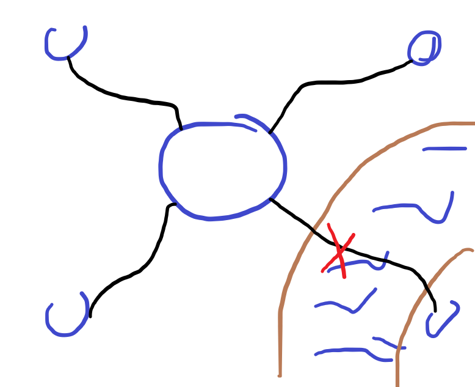

**A journey of a thousand miles begins with the first step**
- lord of the rings

**Red sky in the morning, sailor's warning; red sky at night, sailor's delight**
- game that mirrors a mechanic one the left and right side of the screen
- for example good/bad

**More than meets the eye**
- 

Favorit (Max):
**Rome wasn't built in a day**
- rom wird versucht aufzubauen
- und du verhinderst das es an einem tag aufgebaut
- gebäude umschießen
- ressourcen klauen
- handelstraßen unterbrechen
- "anti strategiespiel"
- setup in dem rom in einem tag gebaut
- schwierigkeitsgrad (bsp. Zeit langsamer)
- Varianten:
	- First Person, sachen umschießen etc.
	- Aufbaustrategie (sachen schlecht bauen)
	- **Manipulationsstrategie** (Puzzlegame)

- you are a corrupt senator and you have to stop rome from being built in a day without being caught
- maybe each hour you can choose a thing that will be done next -> you have to slow down the building process with the right cards
https://assetstore.unity.com/packages/3d/environments/historic/rome-pack-stylized-low-poly-151874

Backup:
**A sledge hammer to crack a nut**
- verschiedene nüsse die mit einem sledge hammer kaputt gemacht werden müssen
- man darf nicht hart hauen, damit die nuss überlebt
- nüsse:
	- Walnuss
	- Haselnuss
	- Kokosnuss
	- Supernuss

---
**Rome wasn't built in a day**
- corrupt senator that does not want to get caught 
- action cards (ie. hire pirates to take over roman ship -> slows down build time by 1h | increases suspicousness by 20%)
- get caught system
	- suspicousness
	- each card has a percentage to get caught
	- supicousness and percentage play together, higher supicouness equals higher percentage
- x cards in the beginning that define your playstyle (ie. you want to destory water routes more often -> water more efective -> land less effective)
- move senator around the playing field
	- every turn a field is opened up
	- if you are on the field... fuck
	- if you are not lower supicousness by distance to field
- different cards
	- manipulation -> susp up
	- do something good -> susp down
	- neutral -> susp nothing
---
1. automatically build up rome (max)
2. dynamic actions system (max)
	1. for example destroy street etc.
3. card system (mike)
	2. different types of cards
	3. how many cards should appear (variable)
4. suspicousness and percentage system (jannis)
	4. think about how the get caught percentage should work
	5. suspicousness scale
	6. interaction susp and perc